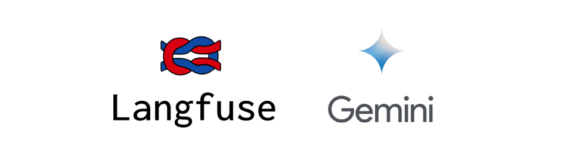

# LLMOps Project with Langfuse

<div align="center">
  <!-- Replace with your project logo or team photo -->
  
</div>

[](https://langfuse.com)
[](https://www.python.org/downloads/release/python-3105/)
[](LICENSE)
[](https://github.com/your-username/your-project)
[](https://hub.docker.com/r/your-username/your-project)


## 🚀 Quick Overview

This LLMOps project leverages Langfuse 2.53.3 for comprehensive observability and evaluation of language model applications, built on top of Python 3.10.5.

## 📋 Prerequisites

- Python 3.10.5
- Langfuse 2.53.3
- pip
- Docker Desktop

## 🛠️ Installation

### 1. Clone the Repository

```bash
git clone https://github.com/nachojeda/RagFuse.git
cd RagFuse
```

### 2. Set Up Virtual Environment

```bash
python3.10.5 -m venv venv
source venv/bin/activate  # MacOS
```

### 3. Install Dependencies

```bash
pip install -r requirements.txt
```

### 4. Configure Langfuse Credentials

Create a `.env` file in the project root:

```
GOOGLE_API_KEY=<your_secret_key>
LANGFUSE_SECRET_KEY=<your_secret_key>
LANGFUSE_PUBLIC_KEY=<your_public_key>
LANGFUSE_HOST=https://localhost:3000
```

## 🔍 Project Structure

```
llmops-project/
│
├── documents/
│   ├── dracula.pdf
│
├── notebooks/
│   ├── langfuse-gemini.py
│   ├── ragfuse-langchain-tracing.py
│
├── src/
│   └── img/
│       ├── langfuse_logo.png
│   ├── main.py
│   ├── rag_utils.py
│
├── configs/
│   └── config.yaml
│
├── docker-compose.yml
│
├── langfuse_run.sh
│
├── requirements.txt
│
├── README.md
│
└── .env
```

## 🧪 Getting Started

To get started, it is necessary the local deployment of the Langfuse app via Docker 
```bash
docker compose up
```
Once the app is deployed, it will be accessible through [http://localhost:3000](http://localhost:3000).

### Running the Application
To run the app you need to change to the main file directory
```bash
cd src
```
and execute it via python
```bash
python src/main.py
```

To personalize the event production, you should change user and session id in the main.py file
```python
langfuse_context.update_current_trace(
    user_id="Nacho Ojeda Sanchez",
    session_id="test-20241212"
    )
```

## 🤝 Contributing

Contributions are very welcomed. If you come across with any bug or improved feature, it will be very welcomed! To add new features follow the next steps:

1. Fork the repository
2. Create your feature branch (`git checkout -b feature/AmazingFeature`)
3. Commit your changes (`git commit -m 'Add some AmazingFeature'`)
4. Push to the branch (`git push origin feature/AmazingFeature`)
5. Open a Pull Request


## 🔒 Security

Ensure all sensitive credentials are stored in `.env` and never committed to version control.

## 📜 License

Distributed under the MIT License. See `LICENSE` for more information.

Project Link: [https://github.com/nachojeda/RagFuse.git](https://github.com/nachojeda/RagFuse.git)


